# Programming Languages Project A1

Submission repository for our Programming Languages class projects. Each group has its own folder. Push your project files into your group's folder only.

## Groups

- Fajardo-Baybay
- Aldueza-Capales
- Diamola-Vallezer
- Eludi-Cabiling
- Gemparo-Deanmark
- Caling-Taro
- Menguito-Vasquez_Nico
- Lumpas-Gargao
- Ligad-Vasquez_Justine
- Anislag-Camingue-Galo
- Romanillos-Gepalla

## How to Submit

1. Clone this repository:
   ```bash
   git clone https://github.com/mrfost07/Programming-Languages-Projects--A1.git
   cd Programming-Languages-Projects--A1
   ```

2. Create a feature branch with your group name:
   ```bash
   git checkout -b submission/<your-group-folder>
   ```

3. Place all your project files inside your group's folder (e.g. `Fajardo-Baybay/`). Do not modify other groups' folders.

4. Commit and push:
   ```bash
   git add <your-group-folder>/
   git commit -m "Submit: <your-group-folder>"
   git push -u origin submission/<your-group-folder>
   ```

5. Open a Pull Request on GitHub targeting the `main` branch.

## Example (Windows Walkthrough with Screenshots)

This is a complete real example. In the screenshots the group folder used is **Fostanes** — just replace it with **your own** group folder name as you follow along.

### Before you start

- **Install Git** first: https://git-scm.com/download/win (default options are fine).
- **Authenticate with your GitHub account.** The easiest way is to install GitHub CLI from https://cli.github.com/ then run this once in any terminal and follow the browser prompts:
  ```bash
  gh auth login
  ```
  (No GitHub account yet? Make one at https://github.com first.)

### Step 1 — Make a working folder and open it

In File Explorer, make a new folder to work in (right-click → **New** → **Folder**). Open it.

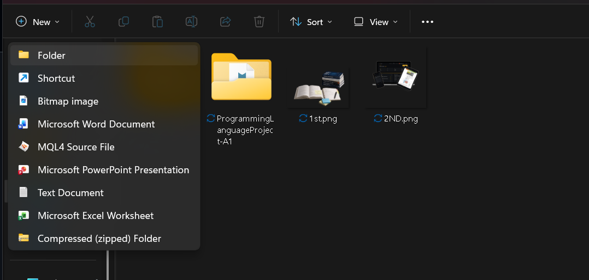

### Step 2 — Click the address bar

Inside that empty folder, click the **address bar** at the top of File Explorer.

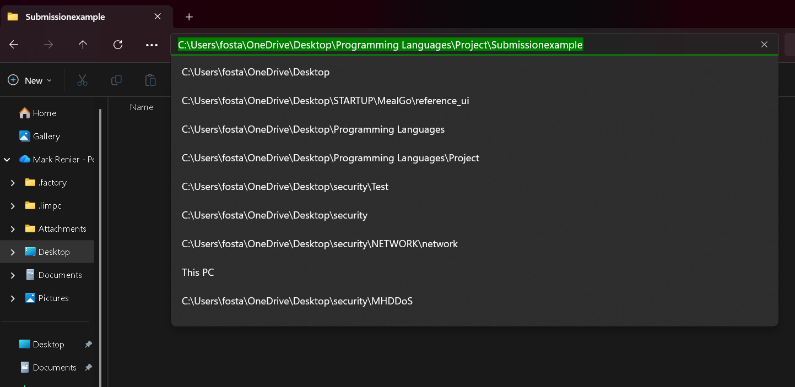

### Step 3 — Type `cmd` and press Enter

Type `cmd` into the address bar and press **Enter**.

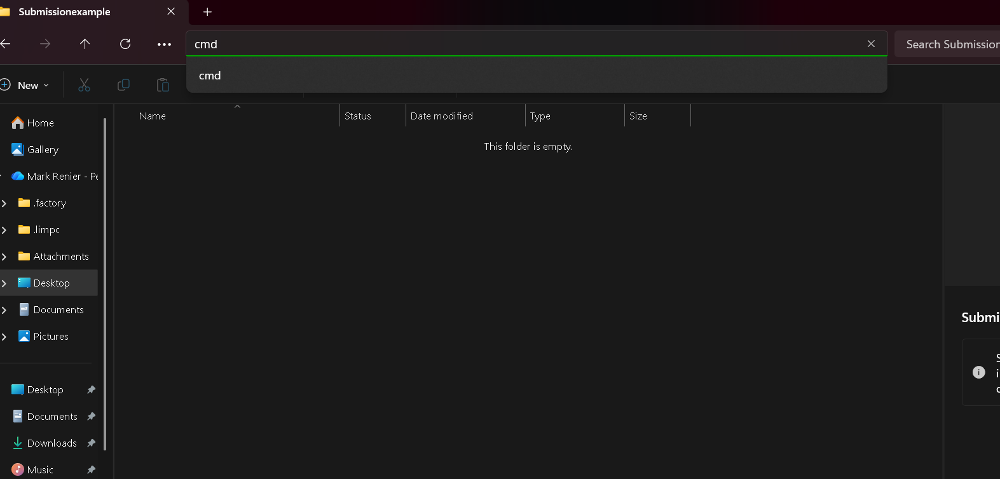

### Step 4 — Command Prompt opens in that folder

A black Command Prompt window opens, already pointing at your folder.

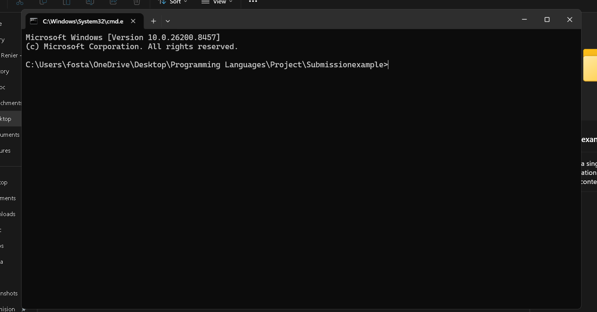

### Step 5 — Type `git clone` (with a space after it)

In the terminal, type `git clone ` (don't press Enter yet — leave a space).

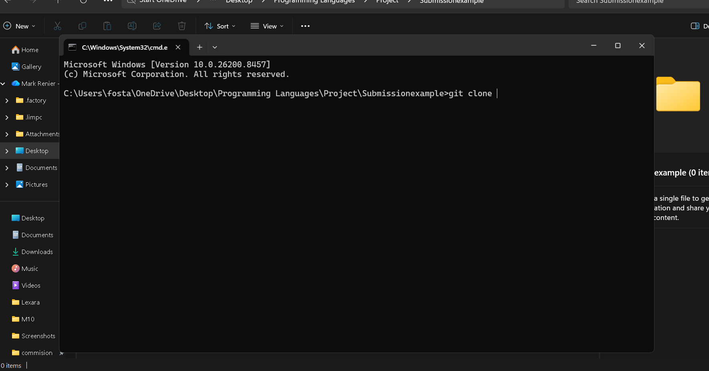

### Step 6 — Copy the repo URL from GitHub

On the repo page, click the green **Code** button and copy the HTTPS URL.

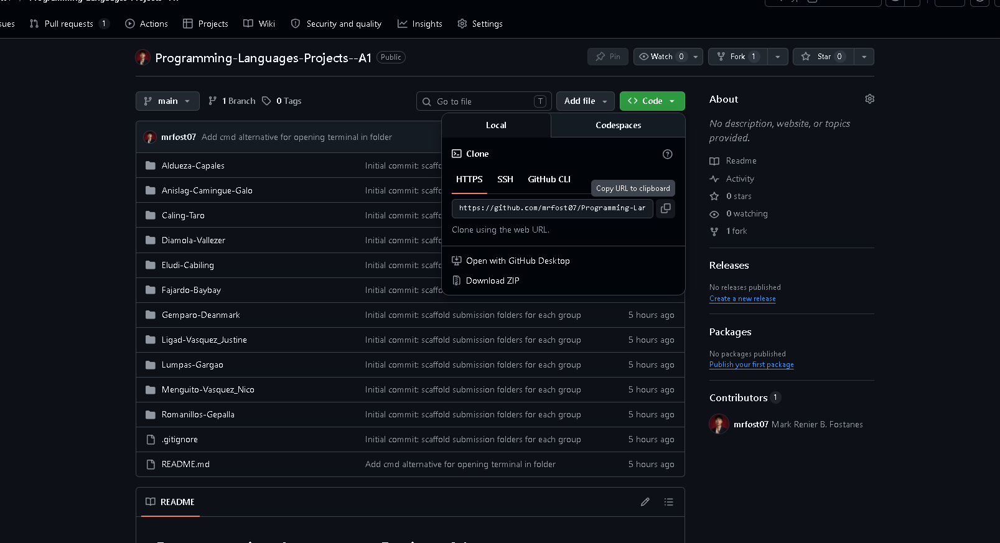

### Step 7 — Paste the URL and press Enter

Paste the URL right after `git clone `, press **Enter**, and wait for it to finish downloading.

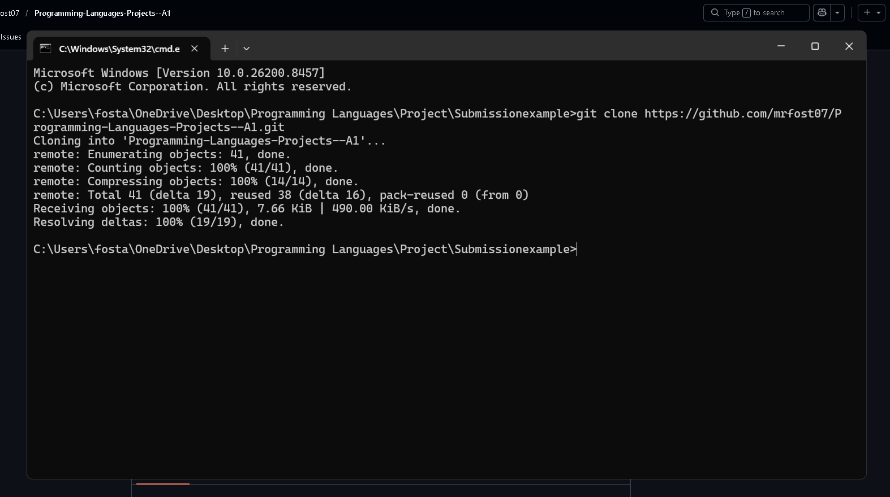

### Step 8 — Open the cloned folder

A new folder called `Programming-Languages-Projects--A1` appears. Open it.

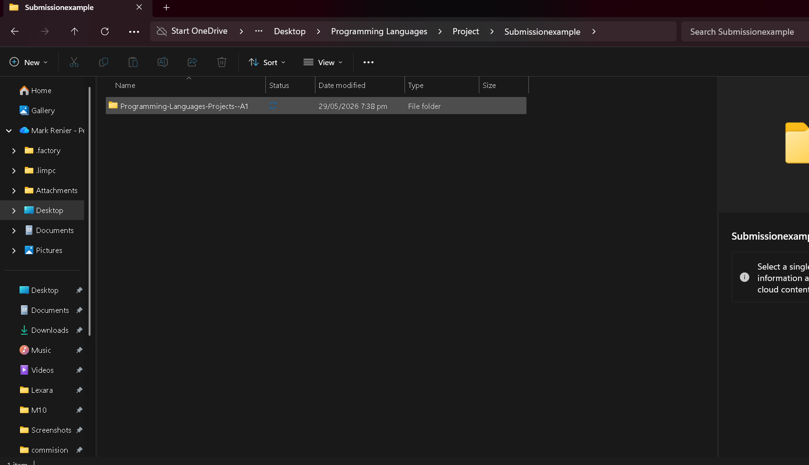

### Step 9 — Find your group folder (create it if it's missing)

Inside, you'll see all the group folders. Find yours. **If your group folder isn't there, create it** (right-click → New → Folder) and name it exactly your group name.

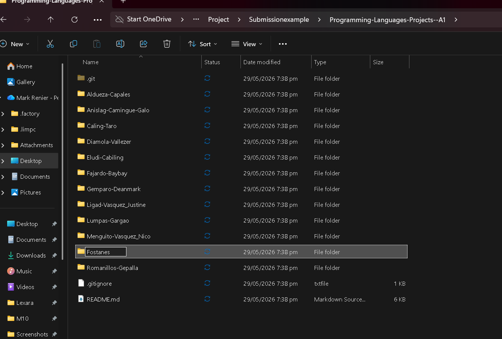

### Step 10 — Paste all your project files into your group folder
Open another file manager, navigate to your project copy or drag and drop **all** your project files and folders here.

⚠️ **Do NOT include `node_modules` or virtual environment folders (`venv`, `.venv`).** Only your actual source code, files, and folders.

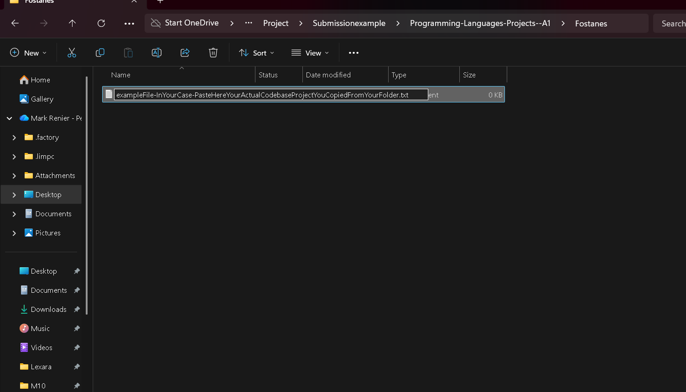

### Step 11 — Go back to the terminal and create your branch

Back in the terminal, go into the repo folder and create your own branch (replace `Fostanes` with your group):

```bash
cd Programming-Languages-Projects--A1
git checkout -b submission/Fostanes
```

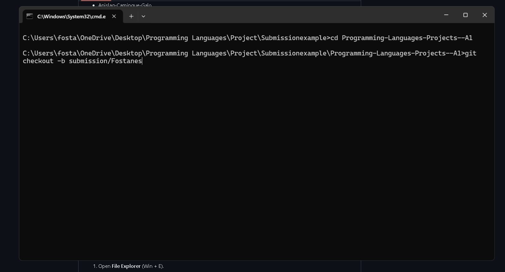

### Step 12 — Check your changes with `git status`

```bash
git status
```

Your group's folder should show up as an untracked change.

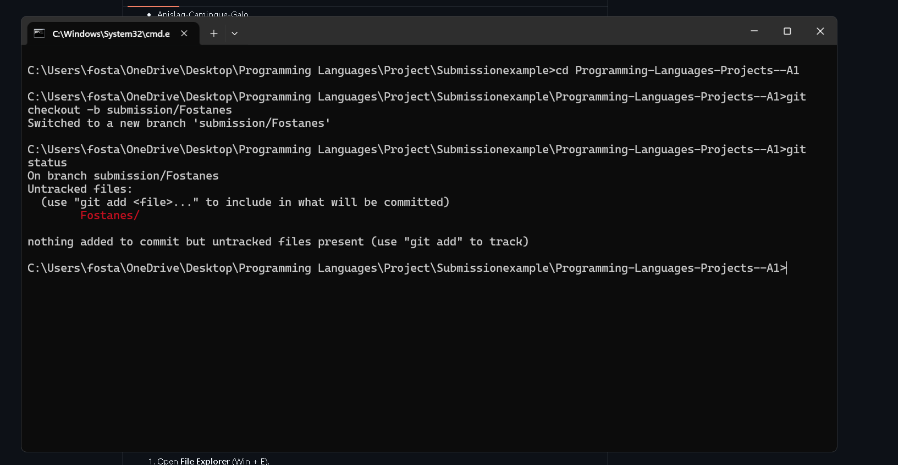

### Step 13 — Stage your folder with `git add`

```bash
git add Fostanes/
```

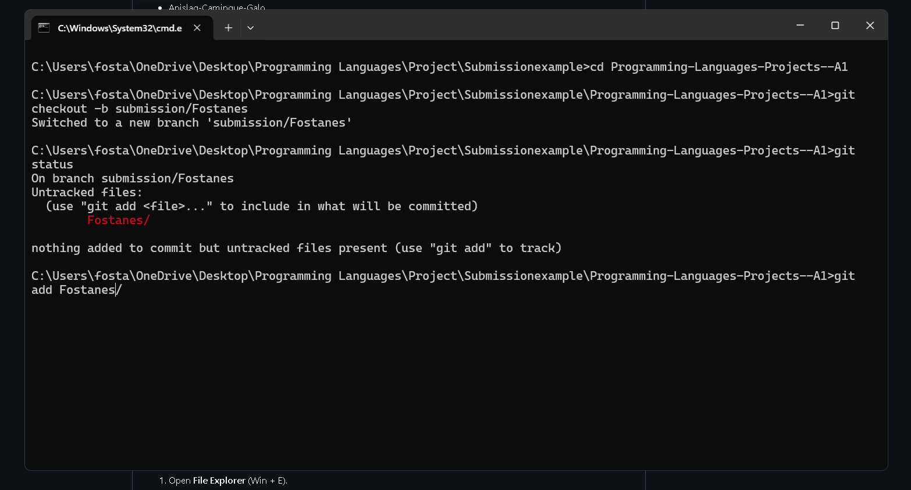

### Step 14 — Commit with a message

```bash
git commit -m "your message here"
```

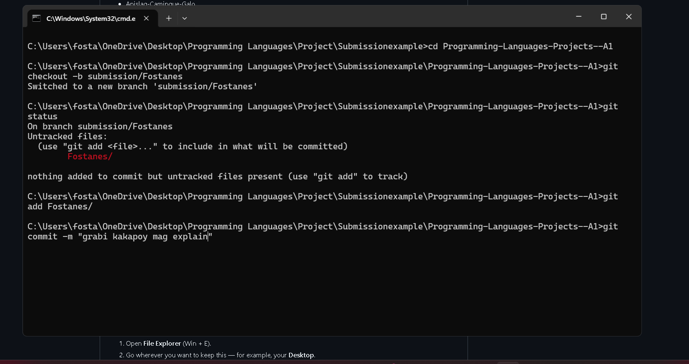

### Step 15 — Push to GitHub

```bash
git push -u origin submission/Fostanes
```

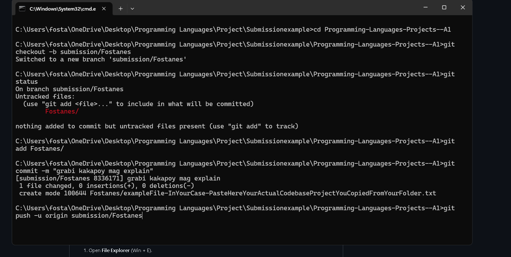

### Step 16 — Go back to the repo, click Compare & pull request

After pushing, open the repo on GitHub. You'll see a yellow banner — click **Compare & pull request**.

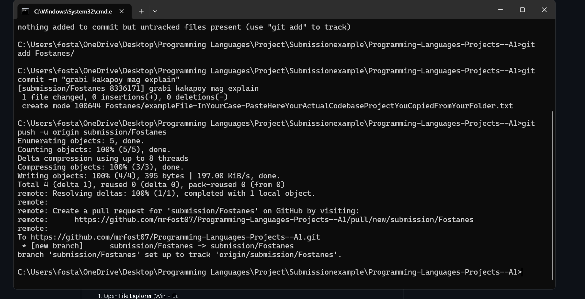

### Step 17 — Click Create pull request

Fill in a title if you want, then click **Create pull request**.

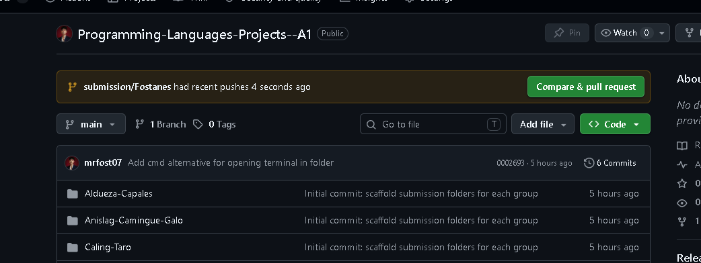

### Step 18 — Done

That's it — your submission is in. ✅

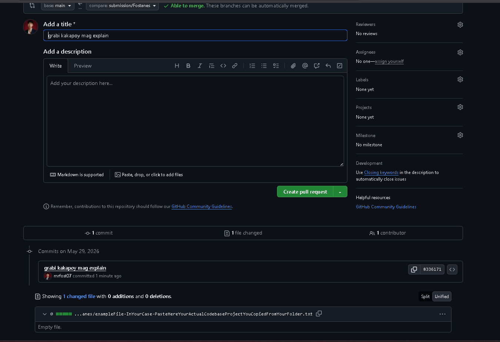

### Full command summary

Type these in your terminal. Replace `Fostanes` with your group folder name:

```bash
# In your empty working folder: click the address bar, type cmd, Enter
git clone https://github.com/mrfost07/Programming-Languages-Projects--A1.git
cd Programming-Languages-Projects--A1
git checkout -b submission/Fostanes
# (now paste your project files into the Fostanes folder — NO node_modules / venv)
git status
git add Fostanes/
git commit -m "your message here"
git push -u origin submission/Fostanes
```

## Rules

- Only edit files inside your own group folder.
- Include a `README.md` inside your folder describing your project, members, and how to run it.
- Do not commit large binaries, build artifacts, or virtual environments (see `.gitignore`).
